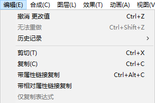
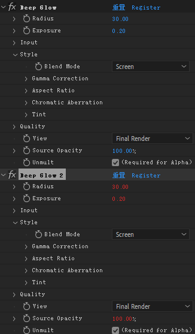
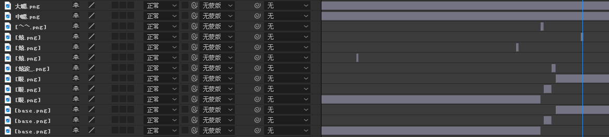
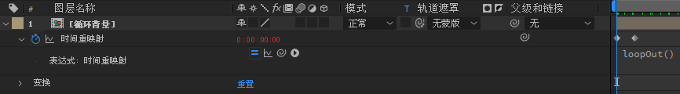

# AE使用记录

以前零零散散学了一些，快速实践了一些特效，尤其是mmd的伪3d用的比较多。现在打算认真系统地学一下，目标是达到熟练高效地做文字特效，从而配合音乐做PV的水平。

## 快捷键
- time line
  - `b` `n` Work Area begin and end
  - `+`, `-` 时间轴缩放
  - `j`,`k` 有编辑的关键帧跳动 `i`,`o` 开头关键帧和最后关键帧。
  - `[` `]`
  - `alt+[ ]`
  - `alt + /` 预览适当
  - `home`：时间轴回到初始
  - `ctrl + alt + s` save this frame to psd
  - `*`
- layer
  - `r`: rotation
  - `t`: 透明度
  - `s`: scale
  - `p`: place
  - `t`: transport
  - `shift + ?`: add ?
  - `uu`：展开当前layer的修改过的参数
  - `u`：收起当前layer参数
  - `ctrl + d`：layer复制
  - `ctrl + shift + d` 切割
  - `ctrl + alt + f` fit the composition
  - `ctrl + alt + /` 替换所选图层的源
- `'`：显示中心点
- `y`：选择anchor
- `ctrl + home`：shape layer刚画出来时，锚点anchor移动到画面中心。
- `ctrl + alt + home`：锚点移到layer的中心。
- `ctrl + '`：展示网格grid
- `ctrl + shift +  '`：grid 吸附
- `ctrl + alt + f` fit the composition
- `ctrl + alt + c` 带属性链接复制。这样只能修改原本，连带副本一起修改。
  - 
  - 对于特效来说，先复制一个副本，选择原本你特效属性，带属性链接复制，再选中副本特效，再粘贴，再复制副本特效到多个。

## PX file プロキシ

提前渲染，预览时用渲染的文件，减小符合，最终渲染时再取消选择，渲染原本文件。

## 遇到的问题
- 文件整理，可以减小文件量，选择输出的合成然后 `文件-减少项目` 
- 崩溃后再打开时，移动时间轴光标，画面没有变化或者黑屏，重启电脑则解决。

## 教程

打算从[PuttiMW](https://www.youtube.com/@PuttiMW)这个频道作为主线，讲解是女声，比较容易入耳。
- [x] #01 这个视频是一些界面介绍，我已经掌握，没有太多可说的。
- [x] #02 设定相关。缓存盘用SSD。右侧的panel可以solo模式，点开新的旧的关闭。
- [ ] #03 shape layer相关
  - [x] 关于'fill'和'Stroke'的一些操作。双击椭圆形能创建出 elipse的锚点位置和位置都是0的圆，这样能保证shape layer的锚点位置和elipse的相同都是0。可能这里需要阐明。'fill'涂和'Stroke'线都能分开展示。
  - [x] 关于pen tool：view-snap to grid 可以吸附在格子点上。时刻注意锚点是否在中间，用y选择锚点。这影响整体变化时的情况。练习trim path的start和end的动画和repeater的复制方法。
  - [x] 添加动画merge path，mode里有几种：merge add subtract intersect

    
  - [x] morphing 主要原理是改变一个shape后，可以右键elipse选择convert to bezier path，然后把不同的形状的东西复制到另一个形状的时间轴上不同点，完成变化。
  - [x] 线的offset里有很多功能，这次试了下copy的功能，做出了涟漪的效果。
- [ ] #04
- [ ] #05
- [x] #06 关于导出设置，`B` 确定范围开头 `N` 确定范围结尾。
  - 渲染队列（在AE内渲染）：视频中用了 `QuickTime - Apple ProRes 422HQ` （我只尝试`QuickTime - 动画`，体积比较大）
  - 创建模板：点击输出模块三角形，保存设置模板。
  - 关于alpha视频的渲染设置：目前用不上先不管。
  - 另一种渲染mp4，导出到 `Adobe Media Encoder` 渲染。适合 `H264` ，试了下默认的，质量、大小和渲染速度都比较合适。渲染时内存占用不高，可以干别的，推荐。（如果报错，可以直接打开AME导入AE项目选择合成）

## 脚本

**批量导入脚本**：试用了几款，最后从插入方便，简洁等角度选择了Transcriptive SRT Importer

**自动截取声音片段**：VØID - Silence Remover 可以选择是否保留空隙，反转。
- 参数经验：padding越大保留两侧越多；tolerance越小声音越多 `13, 0.6` 比较好。

**去除空隙**：removeGap.jsx 可以去除空隙，目前执行单次，不能连续执行。

## 各种专题

### BPM
想实现输入一个BPM，然后某个layer能在每个hit处进行动画。目前的实现方法是：利用 [Tempo Marker Creator](https://note.com/iribo/n/n4a43ac1ab338) 脚本输入BPM生成一个布满标记的solid。之后，例如我想要 layer1 的图形在x轴移动的动画在每次遇到标记都做一遍。则在在做好动画后， `alt+左键` x position，填入：
```
var otherLayer = thisComp.layer("Tempo Markers (131 [bpm] / 4 / 0 [s])"); // 获取另一个名为 "name" 的 layer
var markers = otherLayer.marker;
var i = markers.nearestKey(time).index;

// 检查标记名称是否符合 "x_1" 格式 且当前时间超过了这个mark时间，进行赋值
while (i > 1 && (!markers.key(i).comment.match(/^\d+_1+$/) || time < markers.key(i).time)) {
    i--;
}
t = time - markers.key(i).time;
if(i==1 && !markers.key(i).comment.match(/^\d+_1+$/)){ //这里是避免第一个不符合时也会播放的情况
  t=20000;
}
thisProperty.valueAtTime(t)
```

其中匹配的内容根据具体情况修改，这个脚本是我根据 [这个频道](https://www.youtube.com/watch?v=IOoj3t6vhwU) 提供的：

```
n = marker.nearestKey(time).index;
if (time < marker.key(n).time){//如果在当前时间之后，要取前一个
n = n-1;
}
if(n==0 && (time < markers.key(n).time)){
n = 1
}
t = time - marker.key(n).time;
thisProperty.valueAtTime(t)
```
修改的。总的来说，这段代码的功能是找到当前时间之前的与当前时间最接近的标记，再满足两个条件（标记为x_1；在当前时间之前），然后返回该标记对应的属性值。注意AE的layer上的js代码执行逻辑，由于每个时刻都会重新运行代码，那么 `var n = 1` 会在每个时刻重新运行，也就是说n不能存储之前时刻存储的值，每个时刻代码运行是独立的。

这个功能对做音乐视觉效果可能很有用，例如可以用类似字幕srt文件的（名称，时刻，持续时间）数据组转换成marker，然后修改脚本，不同的名称控制不同的动画。

### txt文件转marker

由于现成的「srt文件转AE字幕」的脚本已经有比较成熟的了，我接下了只需要做一个生成srt文件的软件即可。这里考虑两种途径：
- 将OSU等音游的谱面源码转换成srt
- 做一个键盘敲击软件，记录成srt

写一个python语言的软件，要求点击start后开始计时，并且实时监测用户输入键盘d，f，j，k，空格键的情况，其他键忽略。记录内容为（输入键盘名，按下的时间，抬起的时间）这三个要素。点击stop后，停止记录，并按照srt字幕文件格式把记录写入一个output.srt文件中，输入键盘名作为字幕内容写入，按下的时间和抬起的时间正好对应字幕的起始和终止时间。注意一些事项，每个按键记录互相不影响，即使时间上有重合也可以写入srt，不要担心这一点。请告诉我完整代码。……

这个工具目前还有改进空间：给每个按键赋予名字，使得写入srt时是可读的内容而不仅仅是键名称；start按下时和音乐有一定错位，只能靠后期校对，目前没想到怎么解决（从按下第一个键位开始计时）；

### 实现打call动画

基础思路：comment代表打call类型（高举的，低举的，强力的，柔和的等）

这里我想了两种实现打call动画的方案
- 搜索最近marker，根据不同comment播放不同动画，这个原理和上面bpm一样。是脉冲式动画。
  - 按键时间-time-播放动画时刻
  - 按键名-comment-打call类型：高举的，低举的，强力的，柔和的，特殊动作等
  - 按键时长-duration-用来判定强弱？
  - **优劣势**：坏处是例如强弱弱弱就需要拆成4个脉冲动作，展示可能不连续（用淡入淡出中和？），而且需要两个按键jkkk实现，能否j（长按）j（短）j（短）j（短）实现？但这样需要判定duration数值，看上去很麻烦。
- 用脚本根据marker情况给一个layer上的不同属性的时间轴上打上关键帧。是连续的一个动画。
  - 按键时间-time-某个关键帧时刻
  - 按键名-comment-打call类型：决定关键帧属性
  - 按键时长-duration-决定关键帧属性的赋值数值
  - **优劣势**：同一个动画，不能出现覆盖的情况。属性关键帧之间的动作用脚本写，可能效果不好，如何调整似乎很麻烦。

我还是使用了第一种策略：
- srt文件的处理很费时间，因为我经常打出有时间重合的文件，所以要清洗数据。这次尝试 `j` 代表轻柔呼吸灯，`i` 代表重拍呼吸灯，`o` 和 `p` 代表星星点点的灯。
- 轻柔呼吸灯
  ```
  var otherLayer = thisComp.layer("Captions"); // 获取另一个名为 "name" 的 layer
  var markers = otherLayer.marker;
  var i = markers.nearestKey(time).index;
  // 检查当前时间是否超过了这个最近mark时间
  if(i > 1 && time < markers.key(i).time) {
      i--;
  }
  while (i > 1 && markers.key(i).comment !== "j") {
      i--;
  }
  // 现在i=1或者markers.key(i).comment == "j"
  if (markers.key(i).comment == "j"){
    t = time - markers.key(i).time;
  }
  else{
    t = 200000;// 相当于不显示任何动画
      //t = 0;// 显示初始动画
  }
  //if(t>2){//假设这个动画长度为2秒，如果想要超过后固定为特定样子可以使用
  //  t = 0;
  //}
  thisProperty.valueAtTime(t)
  ```
- 重拍呼吸灯 把上面的 `markers.key(i).comment !== "j"`的 `j` 改为 `i` 即可。
- 星灯：这个有两个部分，我找到了解决思路，sumcomp-starpre-star-shape star，的结构，在starpre中添加marker图层，然后打开timeremap，控制闪烁时间：
  ```
  var otherLayer = thisComp.layer("Captions"); // 获取另一个名为 "name" 的 layer
  var markers = otherLayer.marker;
  var i = markers.nearestKey(time).index;

  // 注意既不是 "o" 也不是 "p" 的情况或当前时间超过了这个mark时间，进行前移
  while (i > 1 && ((markers.key(i).comment !== "o" && markers.key(i).comment !== "p")|| time < markers.key(i).time)) {
      i--;
  }
  t = time - markers.key(i).time;
  if(i==1 && markers.key(i).comment !== "o" && markers.key(i).comment !== "p"){
	  t=20000;
  }
  thisProperty.valueAtTime(t)
  ```
  在sumcomp用随机函数确定位置，也要读取marker来确定何时改变种子。
  ```
  var refLayer = thisComp.layer("Captions"); 
  if (refLayer.marker.numKeys > 0) {
      var closestMarkerTime = refLayer.marker.key(1).time; // 假设最接近的标记为第一个标记
      var seed = 1; // 默认的种子值
      for (var i=1; i <= refLayer.marker.numKeys; i++) {
          if (Math.abs(time - refLayer.marker.key(i).time) < Math.abs(time - closestMarkerTime) && (refLayer.marker.key(i).comment == 'o' || refLayer.marker.key(i).comment == 'p')) {
              closestMarkerTime = refLayer.marker.key(i).time; // 找到更接近当前时间的标记
              seed = i; // 更新种子值为当前标记的索引
          }
      }
      seedRandom(seed, true);
      x = random(0, 1920);
      y = random(0, 1080);
  } else {
      x = value[0]; // 如果没有标记
      y = value[0]; // 如果没有标记
  }
  [x, y]
  ```

### DJ式添加歌词字幕

步骤：
- 搜索歌词复制得到`kashi.txt`
- 打开`keyboard_to_srt`，一边播放音乐，点击start，看着`kashi.txt`敲击键盘，听每一句的持续时间，控制键盘按下时间。得到`output.srt`
- 用脚本把`output.srt`导入到AE，播放视频，回想之前敲击时的错误，修改`output.srt`文件，而不是直接修改AE上文本图层上的marker（这样便于以后使用，当然如果有导出图层文本marker的脚本就行，目前我没有），注意srt文件时间格式和AE上复制来的时间格式不一样。
- 再把修改后的`output.srt`导入到AE，播放确认。

### 帧率问题

在某个属性或者时间重映射应用以下表达式，可以在不影响合成帧率的情况下，改变单个图层的播放帧率。

```
posterizeTime(10);
value;
```

###  文字分解

教程参考：https://www.youtube.com/watch?v=PFbQC1DAdkI

文字为单位分解脚本：GG分解 https://x.com/gummasimedi/status/1190626096036773888

笔画为单位分解脚本：https://aescripts.com/cuttananir/?aff=102

## 关于 ずんだもんゆっくり系 动画

前言：日本人在其他软件做了很完善的维基，并且软件体量很小，似乎很好用。但我用AE习惯了，想继续用脚本解决。

**流程化**：
- 写视频脚本，每行为一句，特殊标记：
  - j:开头表示是日文，在生产中文音声时跳过，在生产日文音声时识别。
  - |结尾表示展示特殊zundamon表情，AE导入时自动导入图片，并吧base表情在这里截断。（设置透明度）
  - [ ] 展示图片的自动导入？待施工
- 借助AI把脚本时间戳自动生成大致的srt文件。多复制一行，识别问题。
  - `这是一个视频脚本，每行是一句，j:和|以后的内容为特殊标记，不占内容，请保留。请根据文本长短大致估计语音时长为被一句赋合适的时间戳，给我一个srt文件代码，不要改变我的文本内容。`（其实这里不需要精确，因为之后会算wav语音长度）
- 打开`api_v2.bat`，用`GPT-SoVITS_srt_to_wav.py`生产中文+日文的wav文件
  - 修改srt后用`reset_srt_number.py`重置序号
  - 改变srt顺序后不想重新生成音频则用`change_wavindex_based_srt.py`改写wav文件名序号
  - 如果修改srt文本内容，则记得删除对应wav，重新运行
- `calculate_wavtime_adjust_srt.py`得到考虑音频长度后的srt文件
- 导入pr中编辑视频
- 导出srt
- 使用 `from_srt_and_wavfile_setall_AE(zudamon)` 一步到位
  - 手动把文本和音频创建预合成，选中音频合成，选择动画，关键帧辅助，音频转关键帧。调整文本预合成的位置。
- 在pr中导入合成和背景合成

**zundamon结构**：base图层用闭眼闭嘴的整体画像，上面紧跟睁眼眼部图层，大嘴中嘴只有嘴部，其他表情如果相同时说话则放在两者之间，想完全覆盖则放在最上面。同时让这些出现的特殊表情的时间里，base图层斩断。用代码控制的有base，眼部，大嘴。中嘴。



大嘴图层的代码：
<details>

```
var threshold = 2.0; // 阈值
var onDuration = 0.1; // 大嘴时长
var halfDuration = 0.06; // 中嘴时长
var offDuration = 0.18; // 闭嘴时长
var cutDuration = onDuration; // 收尾动画的截止时长参数1
var cutDuration2 = halfDuration // 收尾动画的截止时长参数1

var frame = thisComp.frameDuration;
var amplitude = thisComp.layer("Audio Amplitude").effect("两个通道")("滑块");
var loopDuration = onDuration + halfDuration + offDuration + halfDuration; // 大->小->闭->小

var eventStartTime = -1;
var eventEndTime = -1;
var inEvent = (amplitude.valueAtTime(time) > threshold);

if (inEvent) {
    var t = time;
    while (t >= 0) { if (amplitude.valueAtTime(t) > threshold) { t -= frame; } else { break; } }
    eventStartTime = t + frame;
} else {
    var t = time - frame;
    var foundEvent = false;
    while (t >= 0) { if (amplitude.valueAtTime(t) > threshold) { eventEndTime = t; foundEvent = true; break; } t -= frame; }
    if (foundEvent) {
        var t2 = eventEndTime;
        while (t2 >= 0) { if (amplitude.valueAtTime(t2) > threshold) { t2 -= frame; } else { break; } }
        eventStartTime = t2 + frame;
    }
}

var finalOpacity = 0;
if (eventStartTime !== -1) {
    var blinkingClock = time - eventStartTime;
    var idealOpacity = (blinkingClock % loopDuration < onDuration) ? 100 : 0;

    if (inEvent) {
        finalOpacity = idealOpacity;
    } else { // 声音停止，进入收尾判断逻辑
        var totalEventDuration = eventEndTime - eventStartTime;
        var timeIntoFinalLoop = totalEventDuration % loopDuration;
        var timeRemainingInLoop = loopDuration - timeIntoFinalLoop;

        if (timeRemainingInLoop < cutDuration || timeRemainingInLoop > cutDuration2) {
            finalOpacity = 0; // 最后一个循环距离结尾过短或过长直接放弃
        } else {
            if (time < eventEndTime + timeRemainingInLoop) {
                finalOpacity = idealOpacity; // 剩余时间足够，继续播放完这一段
            } else {
                finalOpacity = 0; // 播放完毕，关闭
            }
        }
    }
}
finalOpacity;
```

</details>

中嘴图层代码：

<details>

```
var threshold = 2.0; // 阈值
var onDuration = 0.1; // 大嘴时长
var halfDuration = 0.06; // 中嘴时长
var offDuration = 0.18; // 闭嘴时长
var cutDuration = onDuration; // 收尾动画的截止时长参数1
var cutDuration2 = halfDuration // 收尾动画的截止时长参数1

var frame = thisComp.frameDuration;
var amplitude = thisComp.layer("Audio Amplitude").effect("两个通道")("滑块");
var loopDuration = onDuration + halfDuration + offDuration + halfDuration;

var eventStartTime = -1;
var eventEndTime = -1;
var inEvent = (amplitude.valueAtTime(time) > threshold);

if (inEvent) {
    var t = time;
    while (t >= 0) { if (amplitude.valueAtTime(t) > threshold) { t -= frame; } else { break; } }
    eventStartTime = t + frame;
} else {
    var t = time - frame;
    var foundEvent = false;
    while (t >= 0) { if (amplitude.valueAtTime(t) > threshold) { eventEndTime = t; foundEvent = true; break; } t -= frame; }
    if (foundEvent) {
        var t2 = eventEndTime;
        while (t2 >= 0) { if (amplitude.valueAtTime(t2) > threshold) { t2 -= frame; } else { break; } }
        eventStartTime = t2 + frame;
    }
}

var finalOpacity = 0;
if (eventStartTime !== -1) {
    var blinkingClock = time - eventStartTime;
    var cycle = blinkingClock % loopDuration;
    
    var isHalfMouthTime = (cycle >= onDuration && cycle < onDuration + halfDuration) || (cycle >= onDuration + halfDuration + offDuration && cycle < loopDuration);
    var idealOpacity = isHalfMouthTime ? 100 : 0;

    if (inEvent) {
        finalOpacity = idealOpacity;
    } else { // 声音停止，进入收尾判断逻辑
        var totalEventDuration = eventEndTime - eventStartTime;
        var timeIntoFinalLoop = totalEventDuration % loopDuration;
        var timeRemainingInLoop = loopDuration - timeIntoFinalLoop;

        if (timeRemainingInLoop < cutDuration || timeRemainingInLoop > cutDuration2) {
            finalOpacity = 0;
        } else {
            if (time < eventEndTime + timeRemainingInLoop) {
                finalOpacity = idealOpacity;
            } else {
                finalOpacity = 0;
            }
        }
    }
}
finalOpacity;
```

</details>

睁眼的眼睛图层，控制眨眼。

<details>

```
// --- 可调参数 ---
var flickerDuration = 0.2; // 不透明度为0（闪烁）的持续时间（秒）
var minInterval = 6.0;     // 两次闪烁之间的最小间隔时间（秒）
var maxInterval = 10.0;    // 两次闪烁之间的最大间隔时间（秒）
// -----------------


var t = 0; // 这是一个时间指针，从0秒开始计算
var opacityValue = 100; // 默认不透明度为100

// 启动一个循环，从时间线开头开始，一步步地计算出所有闪烁事件的发生时间点
// 直到计算的时间点超过了当前播放头的时间
while (t <= time) {

  // 这是最关键的一步：
  // 我们使用上一个事件的结束时间点(t)作为“随机种子”。
  // 只要种子不变，生成的随机数就永远是同一个值。
  // 这保证了两次闪烁之间的间隔时间是固定的，不会在播放时变来变去。
  seedRandom(t, true);
  
  // 根据设定的范围，生成一个随机的间隔时间
  var randomInterval = random(minInterval, maxInterval);
  
  // 计算出下一次闪烁的“开始时间”和“结束时间”
  var flickerStartTime = t + randomInterval;
  var flickerEndTime = flickerStartTime + flickerDuration;
  
  // 判断一下，当前播放头的时间（time）是否正好落在了我们算出的这个闪烁区间内
  if (time >= flickerStartTime && time < flickerEndTime) {
    opacityValue = 0; // 如果是，那么这一帧的不透明度就应该是0
    break; // 既然已经找到了，就没必要再继续往后计算了，跳出循环
  }
  
  // 如果当前时间不在这次闪烁的区间内，
  // 我们就把时间指针t“跳”到这次闪烁结束的时刻，准备计算下下一次闪烁
  t = flickerEndTime;
}

// 将最终计算出的不透明度值输出
opacityValue;
```

</details>

动画背景做一个循环动画，然后用AE的循环指令。


